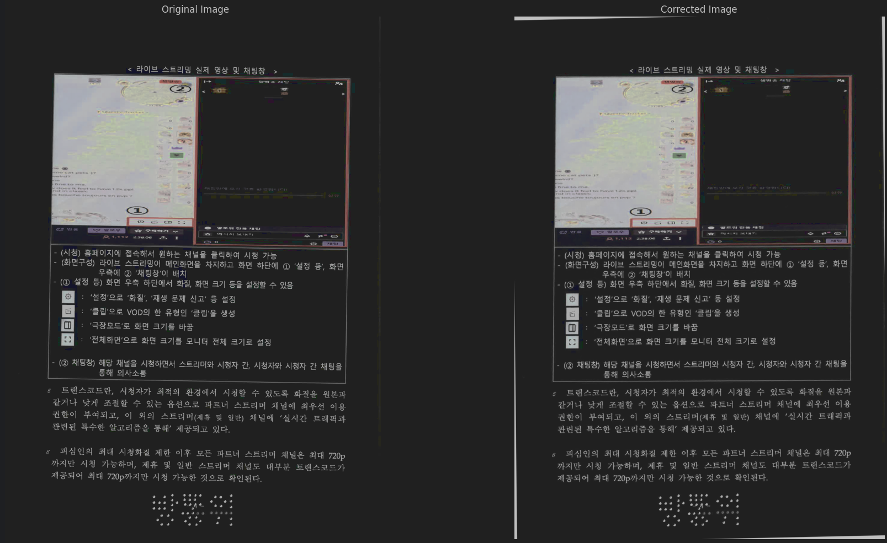
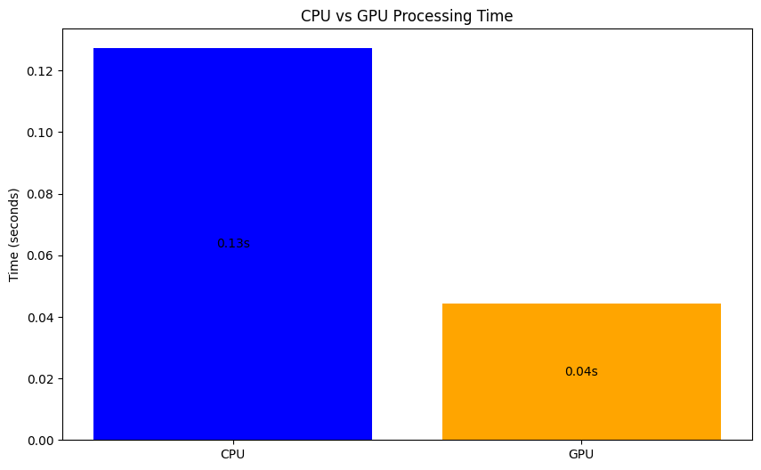

# PDF Orientation Correction

Python project that automatically detects and corrects skewed pages in PDF documents.

## Sample Image

## Features
- Image processing through GPU acceleration
- Automatic skew detection and correction
  - Not Perfect, but works partially
- Multi-page PDF support
- Before/after visualization

## Requirements
Full requirements can be found in the `requirements.txt` file.

## How it Works
1. Convert PDF to images
2. For each page:
   - Perform edge detection
   - Detect lines using Hough Transform
   - Calculate the skew angle
   - Rotate the image if necessary
3. Save the corrected images back to a PDF

**Transformation Process and Accumulator Array**

1.  **Edge Detection:** First, an algorithm like the Canny edge detector is applied to the input image to find edge pixels. The Hough Transform operates on this binary edge map.
2.  **Parameter Space Mapping:** For each edge pixel $(x_i, y_i)$ in the image space, calculate the corresponding $\rho$ value for a range of discrete $\theta$ values (e.g., using 1-degree intervals from $0^\circ$ to $179^\circ$, covering the $0 \le \theta < \pi$ range):
    $\rho = x_i \cos(\theta) + y_i \sin(\theta)$
    Each edge point maps to a curve in the $(\rho, \theta)$ parameter space.
3.  **Accumulator Array:** The $(\rho, \theta)$ parameter space is discretized into a grid called the **Accumulator Array** or **Hough Space**. Each cell $A(\rho_j, \theta_k)$ acts as a counter.
    For each edge pixel $(x_i, y_i)$ and each calculated $(\rho, \theta)$ pair, increment the count in the corresponding accumulator cell $A(\rho_j, \theta_k)$ that the curve passes through.
4.  **Peak Detection:** After processing all edge pixels, find the cells in the accumulator array with the highest vote counts (local maxima or values exceeding a threshold). Each peak $(\rho_{peak}, \theta_{peak})$ corresponds to the parameters of a prominent line in the original image, indicating that many edge pixels lie on that line.

**Application in Document Skew Correction**

1.  Detect edges corresponding to major linear features (e.g., text lines, table borders).
2.  Apply the Hough Transform to the edge map to build the accumulator array.
3.  Identify the peak(s) $(\rho_{peak}, \theta_{peak})$ in the accumulator, representing the dominant line orientations.
4.  Interpret the dominant angle $\theta_{peak}$. Remember that $\theta$ is the angle of the *normal* to the line relative to the positive x-axis. 

    If text lines are ideally horizontal, their normals would be vertical ($\theta \approx 90^\circ$). If the document is skewed by an angle $\alpha$ (where positive $\alpha$ means counter-clockwise rotation of the text lines), the normals to these skewed lines will have an angle $\theta_{peak} \approx 90^\circ + \alpha$.
5.  Estimate the skew angle $\alpha$. Based on the relationship above (and assuming the $0 \le \theta < \pi$ range), the skew angle can be estimated by finding the deviation of the peak angle from $90^\circ$:
    $\alpha \approx \theta_{peak} - 90^\circ$
    *(Note: The exact calculation might need adjustment based on the specific implementation details and the detected angle's quadrant.)*
6.  Rotate the image by $-\alpha$ (the opposite of the estimated skew) to correct the orientation.
